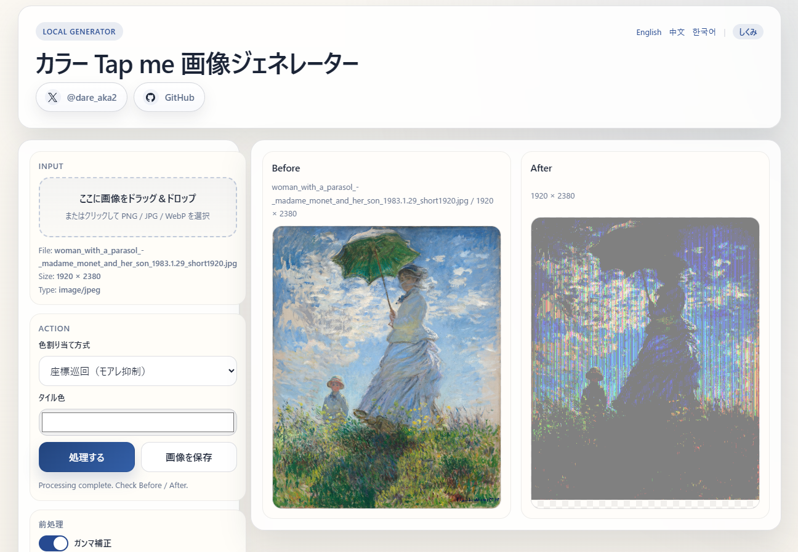

# カラー Tap me 画像ジェネレーター

[日本語](README.md) | [English](README_en.md) | [中文](README_zh.md) | [한국어](README_ko.md)

X（旧Twitter）の「Tap me」カラー画像を生成するブラウザ上のツールです。

**→ [ツールを開く](https://nade-eaf4fc.github.io/tap_me_web/)**

---

## 作例

| Before | After 1 | After 2 |
|--------|---------|----------|
|  |  |  |

→ [作例ツイートを見る](https://twitter.com/dare_aka2/status/2043703166009782359)

---

## 使い方

1. ページにアクセスする
2. 画像をドラッグ＆ドロップ、またはクリックして PNG / JPG / WebP を選択する
3. **処理する** ボタンを押す
4. After 画像を確認し、**画像を保存** でダウンロードする
5. X に投稿する

### X 投稿時の目安

- 単一画像は **2:1〜3:4** の比率だとフル表示されやすい
- 一辺が **2048 px 以上**だとうまくいきやすい
- **4096 px を超える**と X 側で圧縮処理が入り、色が見えてしまう場合がある

---

## 免責事項

- 表示環境・ディスプレイ・OS・アプリなど様々な要素が絡み合うため、すべての環境で意図した結果が再現されることを保証するものではありません。
- 画像処理はすべてブラウザ上でローカルに実行されます。アップロードした画像がサーバーに送信・保存されることはありません。
- 本ツールの使用によって生じたいかなる損害・不利益についても、制作者は責任を負いかねます。

---

## ライセンス

MIT License © [@nade_eaf4fc](https://x.com/nade_eaf4fc)
