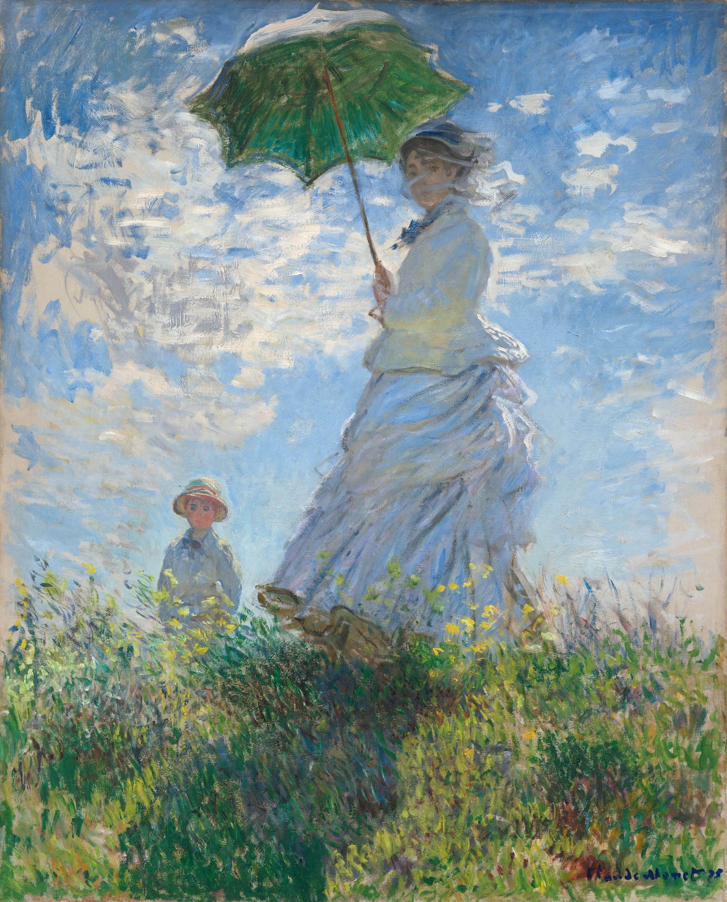
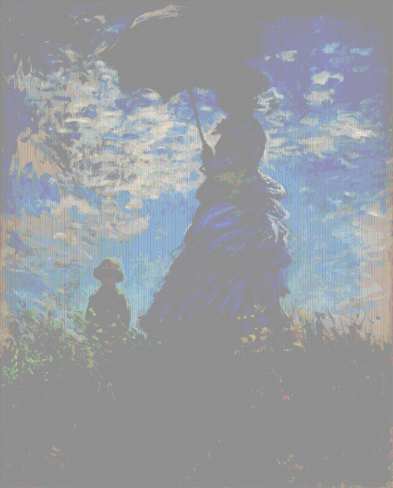
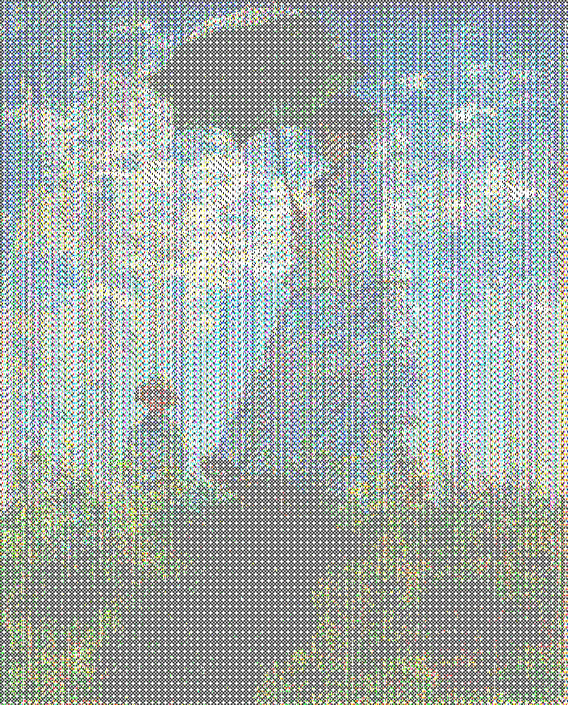

# 颜色 Tap me 图像生成器

[日本語](README.md) | [English](README_en.md) | [中文](README_zh.md) | [한국어](README_ko.md)

一个在浏览器上生成 X（原 Twitter）"Tap me" 颜色图像的工具。

**→ [打开工具](https://nade-eaf4fc.github.io/color_tap_me_web/)**

---

## 示例

| 原图 | 效果1 (无伽马) | 效果2 (伽马 = 5) |
|--------|---------|----------|
|  |  |  |

→ [查看示例推文](https://x.com/dare_aka2/status/2044358889244885471)

---

## 伽马校正效果

应用伽马校正有助于在较暗的图像中保留色彩信息。

| 无伽马校正 (gamma = 0) | 有伽马校正 (gamma = 5) |
|---|---|
|  |  |

---

## 使用方法

1. 访问该页面
2. 拖放图像，或点击选择 PNG / JPG / WebP 文件
3. 按下 **处理** 按钮
4. 查看处理后的图像，点击 **保存图像** 下载
5. 在 X 上发布

### X 发布提示

- 单个图像最佳宽高比为 **2:1 至 3:4**
- 长边 **2048 像素或更大**效果更好
- 超过 **4096 像素**可能会被 X 压缩处理，导致颜色显示

---

## 免责声明

- 由于显示环境、显示器、操作系统和应用程序等多种因素的影响，结果可能在不同环境中有所不同。
- 所有图像处理均在浏览器中本地执行。上传的图像不会发送到服务器或储存在服务器上。
- 制作者不对使用本工具造成的任何损害或不利后果承担责任。
- 本工具使用 Google Analytics 进行访问分析。Google Analytics 使用 Cookie 收集用户访问数据。详情请参阅 [Google 隐私政策](https://policies.google.com/privacy)。

---

## 示例图像

**Claude Monet**, *Woman with a Parasol – Madame Monet and Her Son* (1875)

- **来源:** National Gallery of Art / Wikimedia Commons
- **来源 URL:** https://www.nga.gov/artworks/61379-woman-parasol-madame-monet-and-her-son
- **版权状态:** 公共领域 / CC0 开放获取图像
- **修改内容:** 为仓库示例用途进行了缩放处理
- **致谢:** Courtesy National Gallery of Art, Washington

---

## 许可证

MIT License © [@dare_aka2](https://x.com/dare_aka2) & [@nade_eaf4fc](https://x.com/nade_eaf4fc)
